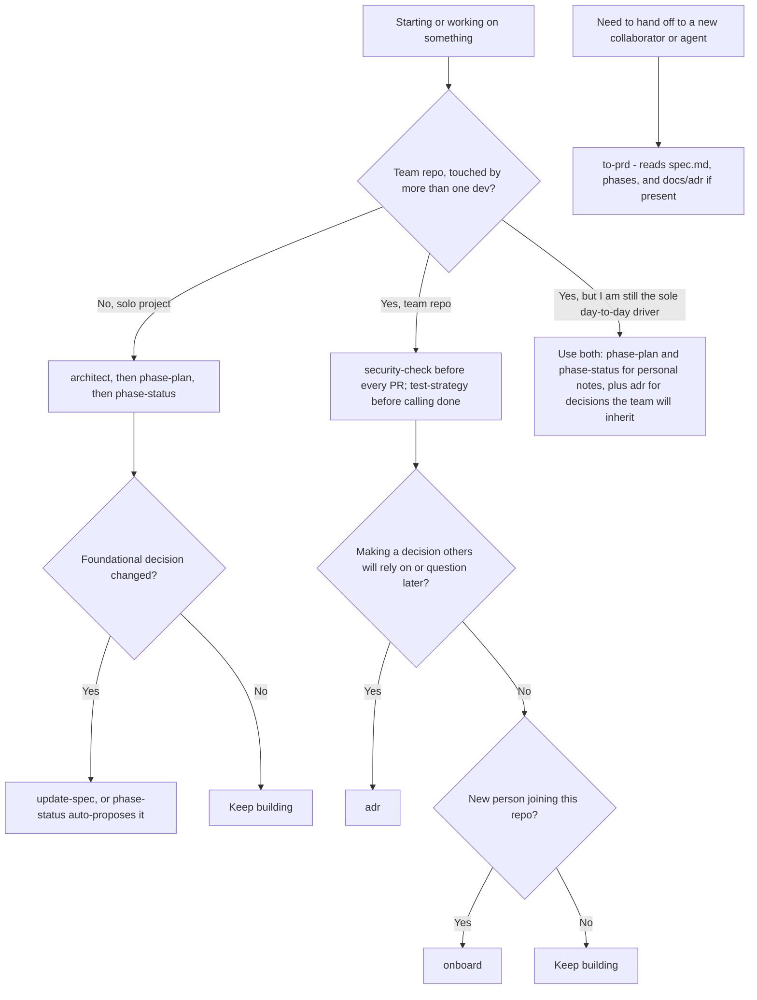

# When to use which skill
 

## Decision flow

## Quick reference table

| Situation | Skill(s) | From |
|---|---|---|
| Starting a new solo project | `architect` | personal |
| Breaking a spec into buildable steps | `phase-plan` | personal |
| Ending a work session | `phase-status` | personal |
| A foundational decision changed (solo project) | `update-spec` | personal |
| Docs feel stale vs. the actual code | `reconcile-docs` | personal |
| Need a handoff doc for a new collaborator/agent | `to-prd` | personal (reads team `docs/adr/` too, if present) |
| Before any commit/PR, any repo | `security-check` | team |
| Before calling code/a phase "done" | `test-strategy` | team |
| A decision other people will rely on or question | `adr` | team |
| New dev joining a repo | `onboard` | team |
| Forgot what's installed | `list-skills` | personal |

## The one combo case worth knowing

If you're the sole day-to-day driver on a repo that other people also
touch or depend on (common right when a solo project first gets adopted
by a team, or you're the lead on a small team project) — **use both at
once**:

- Keep `phase-plan` / `phase-status` for your own working notes and
  session continuity — nothing about a team repo makes that less useful
  for tracking your own progress.
- Start writing new decisions as `adr` entries the moment someone besides
  you needs to trust or question them — this is what actually needs to
  survive beyond your own memory.
- If you eventually need a formal handoff doc, `to-prd` already checks
  for `docs/adr/` and prefers it over spec.md's own changelog for the
  "Key decisions" section — so running both isn't duplicated effort,
  each one is just written for a different reader (you, vs. a future
  teammate).

## What doesn't need combining

`security-check` and `test-strategy` aren't really "team-only" in a
strict sense — nothing stops you from running them on a solo project
too, they're just more load-bearing on a team repo where multiple people
(and the org's actual audited policy) depend on the result. Use judgment:
if a personal side project would benefit from a security pass before you
push it somewhere public, there's no rule against reaching for
`security-check` there either.
